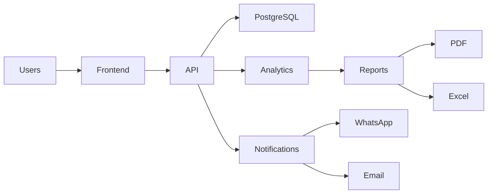

# TFI Command Center 2.0

### AI-Powered Internship Operations & Intelligence Platform

[]()
[]()
[]()
[]()
[]()
[]()

---

## Executive Summary

TFI Command Center 2.0 is an enterprise-grade Internship Operations & Intelligence Platform developed by Techno Future India (TFI) to automate and optimize internship management processes.

The platform serves as a centralized command center for Directors, Hosts, Mentors, and Administrators, enabling real-time monitoring of attendance, assignment submissions, student engagement, performance analytics, certificate eligibility, and operational intelligence.

Instead of relying on spreadsheets, manual attendance sheets, and disconnected communication channels, the platform provides a single source of truth for internship operations.

The objective is to improve operational efficiency, enhance mentor productivity, increase student accountability, and provide leadership teams with actionable insights through advanced analytics and automation.

---

# Problem Statement

Managing large internship programs presents several operational challenges:

### Attendance Management

* Manual attendance collection
* Inaccurate participation tracking
* Difficult verification processes
* Time-consuming report generation

### Assignment Monitoring

* Manual review of submissions
* No centralized tracking system
* Difficulty identifying pending assignments
* Poor visibility into student progress

### Performance Evaluation

* Lack of standardized scoring
* No centralized analytics
* Limited student performance insights
* Difficult certificate eligibility calculations

### Administrative Burden

* Multiple spreadsheets
* Duplicate records
* Human errors
* Inefficient reporting workflows

TFI Command Center 2.0 addresses these challenges through automation, analytics, and centralized management.

---

# Product Vision

### Transform Internship Operations into an Intelligent Data-Driven Ecosystem

TFI Command Center 2.0 combines:

* Attendance Intelligence
* Assignment Intelligence
* Student Success Intelligence
* Performance Analytics
* Risk Detection
* Certificate Automation
* AI Insights

into a unified platform.

The goal is to provide complete operational visibility while significantly reducing manual workload.

---

# Core Platform Modules

## Executive Analytics Center (Director Dashboard)

Designed for strategic decision-makers.

### Features

* Internship Health Score
* Batch Performance Overview
* Certificate Forecasting
* Risk Heatmaps
* Weekly Executive Reports
* Performance Trends
* Attendance Trends
* AI-Generated Insights

### Business Value

Allows leadership teams to quickly assess the overall health of internship programs.

---

## Operations Command Center (Host Dashboard)

Designed for daily internship operations.

### Features

* Live Session Monitoring
* Attendance Tracking
* Session Timeline
* Attendance Import Wizard
* Active Session Statistics
* Late Joiner Detection
* Early Leave Detection
* Session Health Monitoring

### Business Value

Provides real-time visibility into ongoing internship activities.

---

## Student Success Hub (Mentor Dashboard)

Designed for mentoring and student management.

### Features

* Assigned Student List
* Assignment Review Queue
* Missing Submission Tracker
* Student Performance Analytics
* AI Recommendations
* Risk Student Monitoring
* Coaching Suggestions

### Business Value

Helps mentors focus on students requiring attention.

---

## System Control Center (Admin Dashboard)

Designed for platform administration.

### Features

* User Management
* Role Management
* Permission Management
* Audit Logs
* API Monitoring
* Security Monitoring
* System Health Dashboard

### Business Value

Ensures platform reliability and security.

---

# Attendance Intelligence Engine

Automatically processes attendance data from:

* Zoom Reports
* Google Meet Exports
* CSV Files
* Excel Files

Tracks:

* Join Time
* Leave Time
* Attendance Duration
* Attendance Percentage
* Late Joining
* Early Leaving
* Engagement Metrics

---

# Assignment Intelligence Engine

Track and manage:

* Assignment Creation
* Submission Status
* Missing Submissions
* Late Submissions
* Resubmissions
* Assignment Scores

Generate:

* Assignment Completion Reports
* Submission Analytics
* Performance Insights

---

# Student Performance Engine

Calculate:

Overall Score =
40% Attendance +
40% Assignments +
20% Participation

Performance Categories:

* Outstanding
* Excellent
* Good
* Average
* Needs Improvement

---

# AI Risk Detection

Automatically identifies:

### High Risk

* Attendance below threshold
* Multiple missing assignments

### Medium Risk

* Low participation
* Late submissions

### Low Risk

* Consistent performance

Provides proactive intervention opportunities.

---

# Certificate Eligibility Engine

Automatically determines eligibility based on:

* Attendance Percentage
* Assignment Completion Rate
* Internship Participation
* Program Requirements

Outputs:

* Eligible
* Warning
* Not Eligible

---

# Reporting Center

Generate:

* Daily Reports
* Weekly Reports
* Monthly Reports
* Internship Completion Reports

Export Formats:

* Excel
* CSV
* PDF

---

# User Roles

## Director

### Responsibilities

* Strategic oversight
* Program monitoring
* Decision making

### Dashboard Features

* Executive Analytics Center
* Risk Monitoring
* Performance Forecasting
* Batch Analytics

---

## Host

### Responsibilities

* Session operations
* Attendance monitoring

### Dashboard Features

* Live Attendance
* Session Analytics
* Participation Monitoring

---

## Mentor

### Responsibilities

* Student guidance
* Assignment review

### Dashboard Features

* Student Success Hub
* Assignment Queue
* Risk Detection

---

## Admin

### Responsibilities

* Platform administration
* Security management

### Dashboard Features

* User Management
* System Monitoring
* Audit Logs

---

# Technology Stack

| Layer            | Technology     | Purpose                      |
| ---------------- | -------------- | ---------------------------- |
| Frontend         | Next.js 15     | Full-stack React framework   |
| UI               | React 19       | Interactive user interfaces  |
| Language         | TypeScript     | Type safety                  |
| Styling          | Tailwind CSS   | Utility-first styling        |
| Components       | ShadCN UI      | Enterprise UI system         |
| Animations       | Framer Motion  | Smooth transitions           |
| Tables           | TanStack Table | Advanced data tables         |
| Charts           | Recharts       | Analytics dashboards         |
| State            | Zustand        | Lightweight state management |
| API              | React Query    | Server state management      |
| Backend          | FastAPI        | High-performance APIs        |
| ORM              | SQLAlchemy     | Database management          |
| Migrations       | Alembic        | Schema migrations            |
| Validation       | Pydantic       | Data validation              |
| Database         | PostgreSQL     | Relational database          |
| Authentication   | Firebase Auth  | Secure authentication        |
| Analytics        | Pandas         | Data processing              |
| Analytics        | NumPy          | Numerical operations         |
| Reporting        | OpenPyXL       | Excel exports                |
| Reporting        | ReportLab      | PDF generation               |
| Storage          | Cloudinary     | File storage                 |
| Notifications    | WhatsApp API   | Messaging                    |
| Notifications    | Resend         | Email delivery               |
| Deployment       | Vercel         | Frontend hosting             |
| Deployment       | Render         | Backend hosting              |
| Database Hosting | Supabase       | Managed PostgreSQL           |
| Monitoring       | Sentry         | Error tracking               |
| Monitoring       | PostHog        | Product analytics            |
| Monitoring       | Uptime Kuma    | Uptime monitoring            |

---

# High-Level Architecture



---

# Project Structure

```bash
TFI-Command-Center/

├── frontend/
│   ├── app/
│   ├── components/
│   ├── hooks/
│   ├── services/
│   └── store/
│
├── backend/
│   ├── app/
│   ├── api/
│   ├── models/
│   ├── schemas/
│   ├── services/
│   └── core/
│
├── database/
│
├── docs/
│
├── scripts/
│
├── .github/
│   └── workflows/
│
├── docker-compose.yml
├── README.md
└── LICENSE
```

---

# Security Features

* Firebase Authentication
* JWT Authentication
* Role-Based Access Control (RBAC)
* API Rate Limiting
* Audit Logging
* Input Validation
* Secure Environment Variables
* SQL Injection Protection
* HTTPS Enforcement

---

# Future AI Roadmap

### AI Attendance Prediction

Predict attendance drops before they occur.

### AI Performance Forecasting

Estimate final internship outcomes.

### AI Mentor Assistant

Ask questions such as:

> Show students with attendance below 70%.

### AI Assignment Evaluation

Automatically review and score submissions.

### AI Report Generation

Generate executive reports automatically.

---

# Deployment

## Frontend

* Vercel

## Backend

* Render

## Database

* Supabase PostgreSQL

## Monitoring

* Sentry
* PostHog
* Uptime Kuma

---

# Expected Benefits

* 90% reduction in manual operations
* Centralized internship management
* Faster report generation
* Improved mentor productivity
* Better student engagement
* Automated eligibility calculations
* Real-time analytics and insights

---

# About Techno Future India

### Mission

To empower students through industry-focused learning, innovation, and technology-driven education.

### Vision

To build the most advanced internship and skill-development ecosystem that bridges the gap between academia and industry.

### Core Values

* Innovation
* Excellence
* Integrity
* Continuous Learning
* Technology Leadership

---

# License

This project is licensed under the MIT License.

---

### Developed by Techno Future India

**TFI Command Center 2.0 – AI-Powered Internship Operations & Intelligence Platform**
